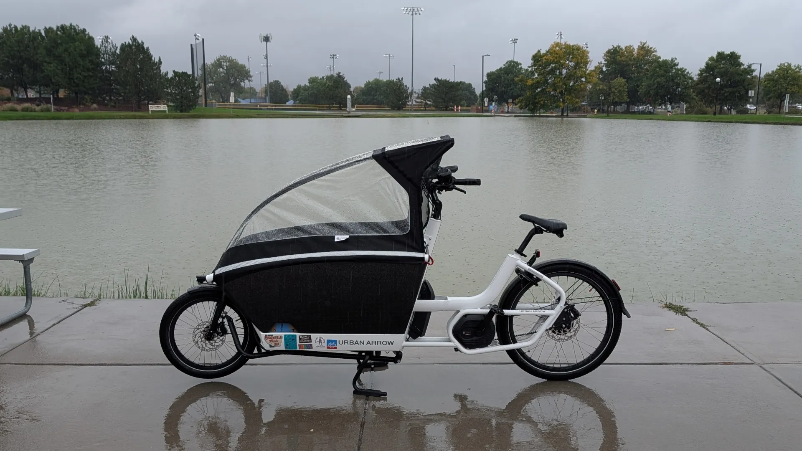
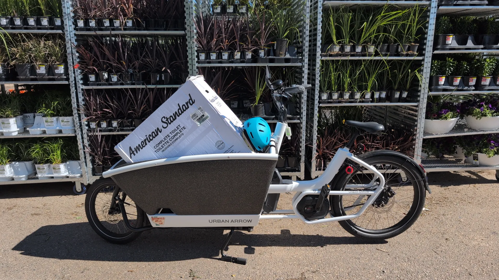

<h2>I love this thing. WE love this thing. </h2>

It's heavy, but it's easy to get used to. I tell everyone "riding it is like the first time you drive a full size truck - it's a little floaty but easy to get comfortable with". I have no problem with it, and my wife who is a foot shorter and 50% my weight got comfortable with it, quick, too.

<h2>It's a school bus.</h2>

Every day we take it to school and listen to the bluey playlist on deezer and point and talk and my older son gets to decide how we get places and what we stop to look at.

<h2>It's a truck.</h2>
Home depot runs are a breeze. For day to day things, from a toilet, to enough lumber to make a solar panel mount on the side of the house, to a few dozen paver caps or a bag of cement and some 4x4's, the bike handles it all well.

It's just a party cruiser to eat ice cream and watch the sunset.

I got it from [front range cargo bikes](https://frontrangecargobikes.com/). They were fantastic. We haven't pared down to just a single car yet, but I almost never drive anymore.
