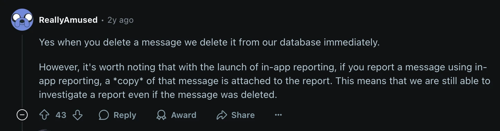
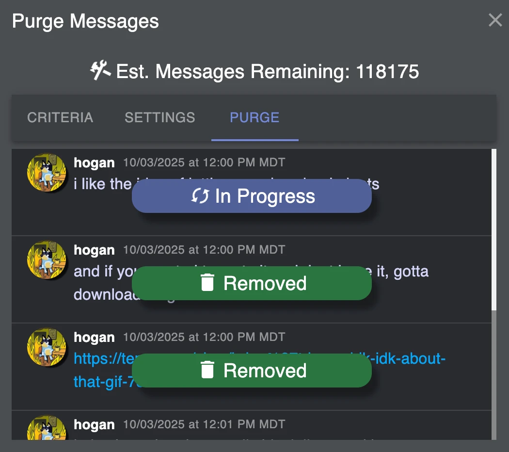

<h2>tl;dr - it sucks and takes forever</h2>

At a startup I worked for called Satellite.im, we used discord for our day-to-day communications and meetings. It was a great tool for the job, and free! It quickly morphed into my go-to tool for business _and personal_ communication. 

Lately, as an American we have to be a little... more careful of how we speak. We are in unprecedented times (unprecedented in the United States, at least), and companies and governments have been more emboldened to do whatever they want with, well, everything, so they can make a quick buck at the expense of whomever and whatever they want.

It is highly likely that there is no way to go back and clean up old data that has been sucked into the machine at Discord, so I have to consider all that data gone, used for whatever. The only real solution is to not use it going foward.

But I am still going to try to delete the old messages.

As of now, Discord doesn't allow most (any?) users the ability to bulk delete data. I am also not even sure they really delete the data. [this post](https://www.reddit.com/r/discordapp/comments/15k3czv/comment/jv3dqke/?context=99) from August 6th, 2023 on Reddit by an alleged former employee indicates that they do in fact delete your messages as long as it's not something that was reported, in which case a copy gets sent along with the report.

So we are going to have to do this the old fashioned way.

So here is how I am doing it:

1. Acquire a chromium browser. I already had Brave installed to test things I need to do in a blink based browser
2. Install [Discrub](https://chromewebstore.google.com/detail/discrub/plhdclenpaecffbcefjmpkkbdpkmhhbj?hl=en-US)
3. Log in to discord in the browser
4. Start purging.

Menu > Direct Messages > Pick someone > Purge Button

Select yourself from the user dropdown.

Change any other settings you want (I changed the Modify Delay Seconds to 1) and hit Purge.

Then you can go on vacation because it iterates through the channel you set and deletes your messages 1 by 1. I am just kidding, don't go on vacation, but it could take weeks running in a tab, and will need to be checked in a few times a day in case it stops.

